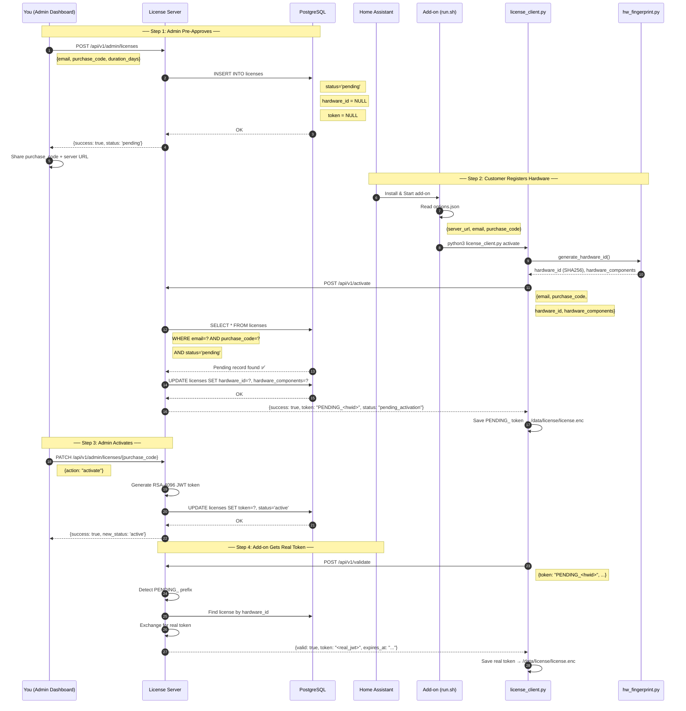
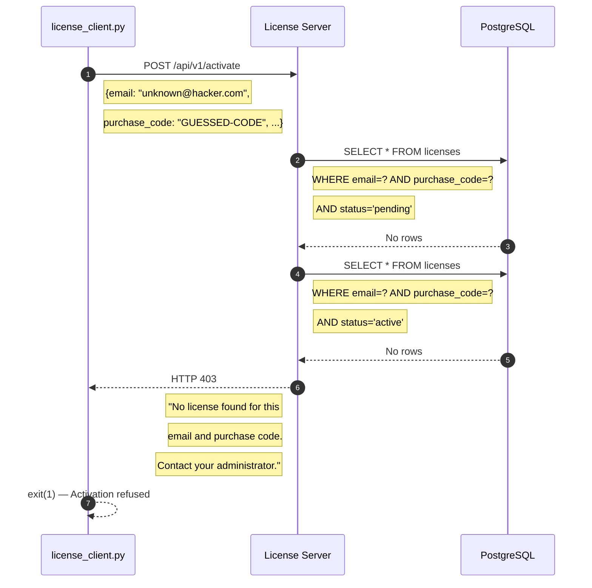
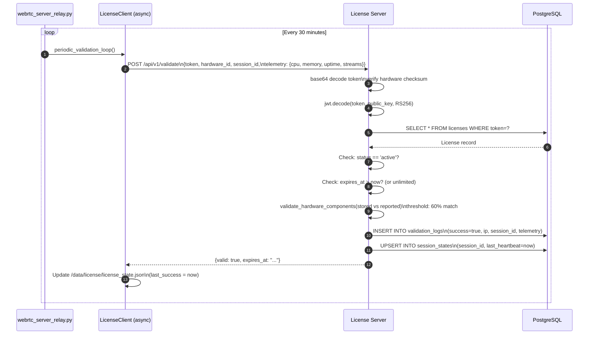
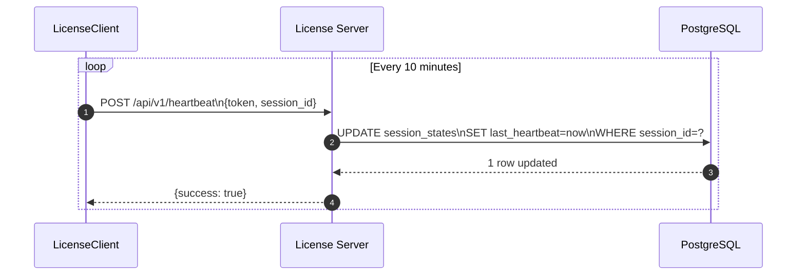
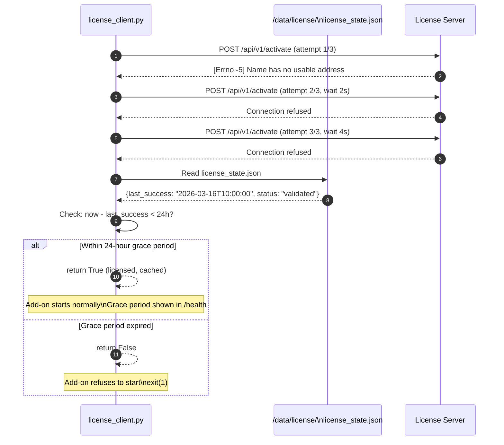
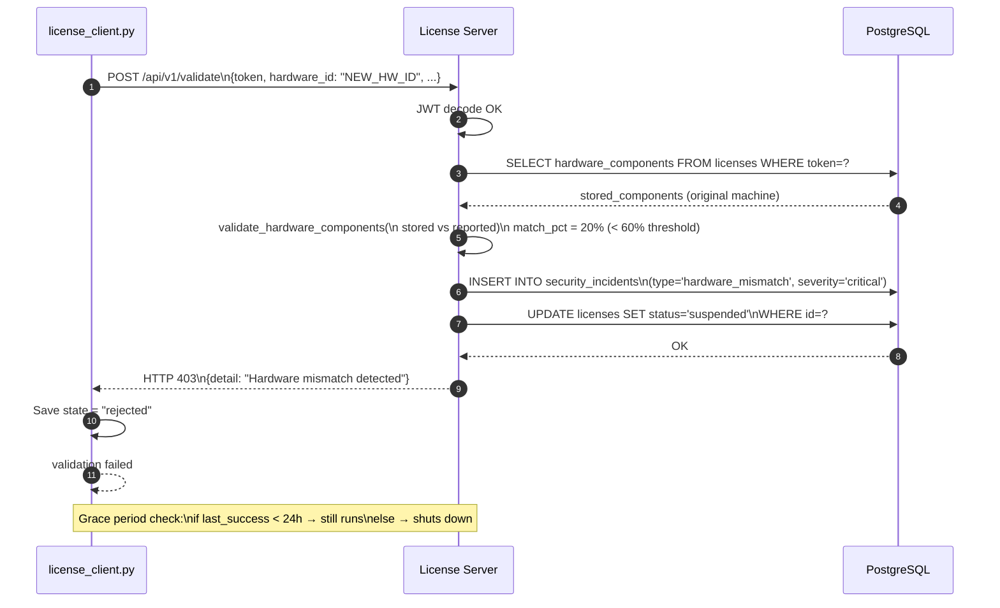
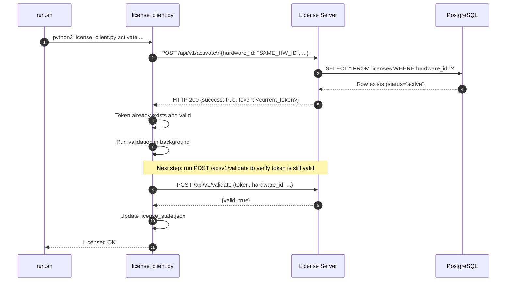
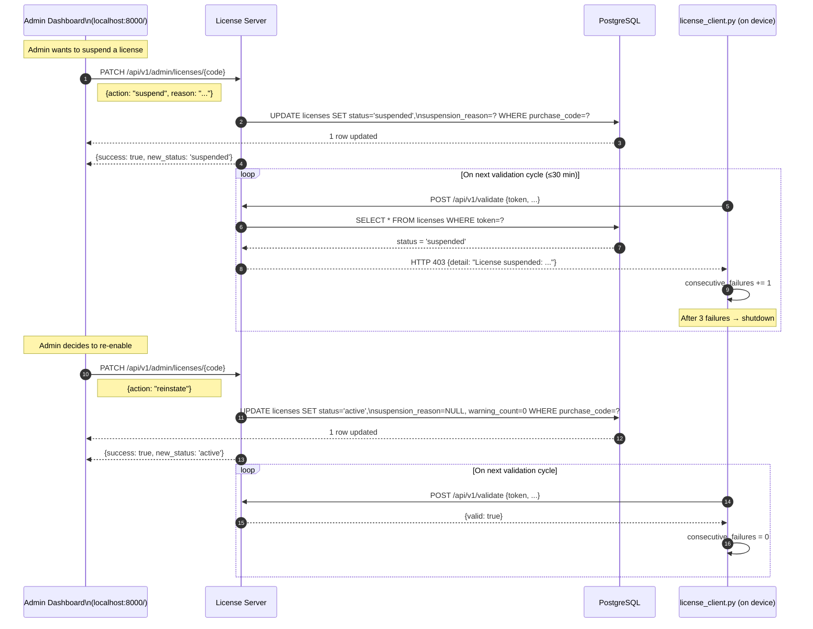
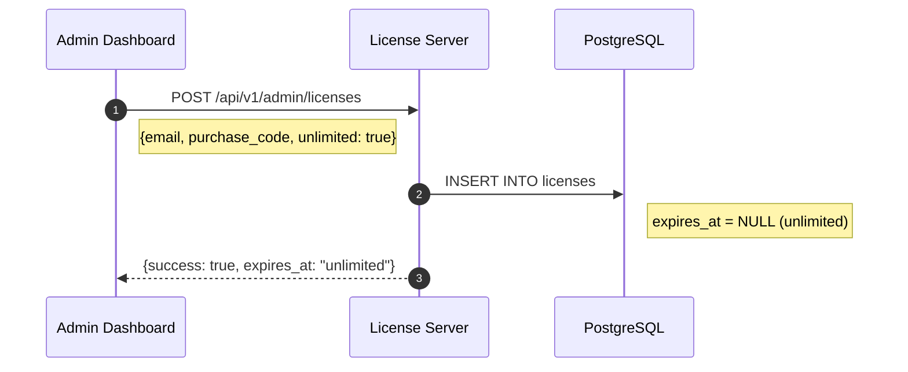
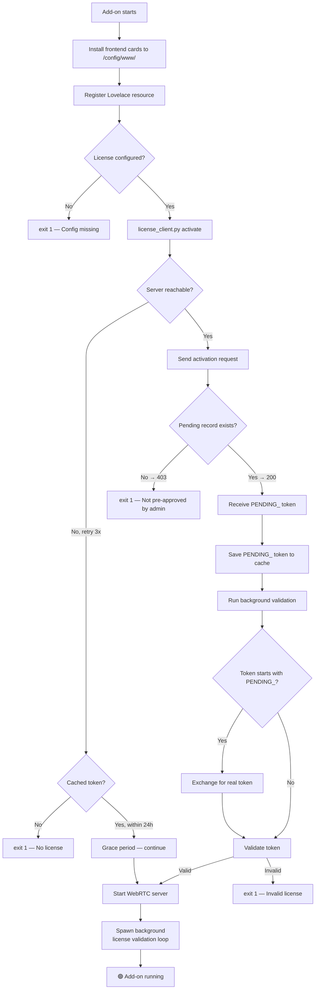

# WebRTC Voice Streaming — Complete License System Guide

> **Audience**: Developer or operator deploying from scratch.
> **Covers**: Architecture, flows, test setup, production setup, admin dashboard, troubleshooting.

---

## Table of Contents

1. [System Architecture](#1-system-architecture)
2. [Component Overview](#2-component-overview)
3. [All Available Flows (Sequence Diagrams)](#3-all-available-flows-sequence-diagrams)
4. [Environment Setup — Test (Local)](#4-environment-setup--test-local)
5. [Environment Setup — Production](#5-environment-setup--production)
6. [Creating & Managing Licenses (Admin Dashboard)](#6-creating--managing-licenses-admin-dashboard)
7. [Add-on Installation & Configuration](#7-add-on-installation--configuration)
8. [End-to-End Test Walkthrough](#8-end-to-end-test-walkthrough)
9. [Security Mechanisms](#9-security-mechanisms)
10. [Troubleshooting Reference](#10-troubleshooting-reference)
11. [API Reference](#11-api-reference)

---

## 1. System Architecture

The system is composed of two completely independent parts that communicate over HTTPS:

```
┌─────────────────────────────────────────────────────────────────────┐
│                     YOUR SERVER (VPS / Cloud)                       │
│                                                                     │
│  ┌──────────────────────────────────────────────────────────────┐   │
│  │                   Docker Compose Stack                        │   │
│  │                                                              │   │
│  │   ┌─────────────┐   ┌─────────────┐   ┌──────────────────┐  │   │
│  │   │    nginx    │   │ license_    │   │   PostgreSQL     │  │   │
│  │   │ (port 80/   │──▶│  server    │──▶│  (port 5432)     │  │   │
│  │   │    443)     │   │ (port 8000) │   │  webrtc_licenses│  │   │
│  │   └─────────────┘   └─────────────┘   └──────────────────┘  │   │
│  │         │                                                        │   │
│  │         │  /keys (SSL volume)                                   │   │
│  │    SSL certificates ←──── RSA-4096 key pair                   │   │
│  └──────────────────────────────────────────────────────────────┘   │
└─────────────────────────────────────────────────────────────────────┘
                                  ▲
                       HTTPS API calls
                     (activate / validate / heartbeat)
                                  │
┌─────────────────────────────────────────────────────────────────────┐
│                   HOME ASSISTANT HOST (LAN)                         │
│                                                                     │
│  ┌──────────────────────────────────────────────────────────────┐   │
│  │               HA Add-on Docker Container                      │   │
│  │                                                              │   │
│  │   ┌─────────────┐   ┌──────────────┐   ┌────────────────┐   │   │
│  │   │  run.sh     │──▶│ license_     │──▶│ webrtc_server_ │   │   │
│  │   │ (startup)   │   │ client.py    │   │ relay.py       │   │   │
│  │   └─────────────┘   └──────────────┘   └────────────────┘   │   │
│  │          │                  │                    │            │   │
│  │   hw_fingerprint.py   /data/license/       background        │   │
│  │   (hardware ID)       (cache + token)       heartbeat loop   │   │
│  └──────────────────────────────────────────────────────────────┘   │
└─────────────────────────────────────────────────────────────────────┘
```

### Key Principle

The **license server** only runs in one place (your VPS). Every HA add-on installation must phone home to validate. If the server is unreachable, a 24-hour **grace period** (cached token) allows continued operation.

> **Admin-Gated Activation**: Licenses are **not self-service**. You (the admin) must pre-create a license record in the dashboard, then click "Activate" after the customer registers their hardware. This prevents unauthorized use even if someone discovers your server URL.

---

## 2. Component Overview

| Component                           | Location        | Role                                                         |
| ----------------------------------- | --------------- | ------------------------------------------------------------ |
| `license_server/main.py`            | Server          | FastAPI REST API — all endpoints                             |
| `license_server/models.py`          | Server          | SQLAlchemy ORM — 4 database tables                           |
| `license_server/token_generator.py` | Server          | RSA-4096 JWT signing/verification                            |
| `license_server/hw_fingerprint.py`  | Server + Add-on | Hardware ID derivation                                       |
| `license_server/index.html`         | Server          | Admin dashboard (modern dark theme, custom modals)           |
| `license_client.py`                 | Add-on          | Async client: activate, validate, heartbeat, grace period    |
| `hw_fingerprint.py`                 | Add-on root     | Fingerprint collector (copy of server version)               |
| `run.sh`                            | Add-on          | Startup script — runs license check before any server starts |
| `webrtc_server_relay.py`            | Add-on          | WebRTC relay — spawns background license loop                |

### Database Tables

```
licenses             → One row per activated device (email × hardware_id)
validation_logs      → Full history of validate calls (success + failure + geo)
security_incidents   → HW mismatch, concurrent sessions, auto-suspensions
session_states       → Currently active client sessions (heartbeat updated)
```

### Token Format

```
BASE64 ( RS256-JWT . HMAC-SHA256-checksum[0:24] )
         ↑                  ↑
   signed with RSA      extra hardware binding
   private key           (prevents token sharing)
```

---

## 3. All Available Flows (Sequence Diagrams)

### 3.1 — Admin Creates License + Customer Activates (Full Two-Step Flow)

The complete lifecycle from admin pre-approval to a running add-on.



---

### 3.1b — Rejected Self-Registration Attempt

What happens when someone tries to activate without admin pre-approval.



---

### 3.2 — Periodic Validation Flow

Runs every 30 minutes in the background from `webrtc_server_relay.py`.



---

### 3.3 — Heartbeat Flow

Runs every 10 minutes (lighter than full validation — no DB write to validation_logs).



---

### 3.4 — Grace Period Flow (Server Unreachable)

When the license server is temporarily offline, the add-on continues running using the locally cached token.



---

### 3.5 — Hardware Mismatch / Security Incident Flow

Triggered when a token is used from a device that doesn't match the registered hardware.



---

### 3.6 — Startup With Already-Activated License (Re-start / Re-install)

When the add-on restarts on the same machine that was already activated.



---

### 3.7 — License Suspension & Recovery Flow

Suspend via admin dashboard or auto-suspension by security incident.



---

### 3.8 — Unlimited License

Licenses with `expires_at = NULL` never expire.



On validation, server checks `expires_at IS NULL OR expires_at > now()`.

---

## 4. Environment Setup — Test (Local)

### Prerequisites

- Docker + Docker Compose installed
- The `webrtc_backend` repository cloned

### Step 1: Configure and Start the License Server

```bash
cd /path/to/webrtc_backend

# (Optional) Set a secure secret key
export SECRET_KEY=$(openssl rand -hex 32)

# Start the server stack
docker-compose up -d --build

# Verify it's running
curl -k https://localhost:8000/health
# Expected: {"status":"healthy","database":"healthy","timestamp":"2026-..."}
```

### Step 2: Open the Admin Dashboard

Open your browser at:

```
https://localhost/ (accept self-signed cert warning)
```

The dashboard shows:
- Total / Active / Suspended license counts
- Service health (API, DB, RSA keys)
- Recent licenses and security incidents
- Create, Edit, Activate, Suspend, Delete license actions

### Step 3: Pre-Create a Test License (Admin Step — Required)

You **must** create a license record on the server before the add-on can activate.

**Option A — Via the Dashboard (recommended):**

1. Open `https://localhost/`
2. Click **+ Create License** 
3. Enter:
   - **Email**: `test@example.com`
   - **Purchase Code**: `MY-TEST-CODE-001`
   - **Duration**: `365` (days) or toggle **Unlimited**
4. Click **Create License** → status shows as **pending** (amber badge)

**Option B — Via curl:**

```bash
curl -X POST https://localhost:8000/api/v1/admin/licenses \
  -H "Content-Type: application/json" \
  -d '{
    "email": "test@example.com",
    "purchase_code": "MY-TEST-CODE-001",
    "duration_days": 365
  }'
# Expected: {"success": true, "status": "pending", "expires_at": "2027-..."}
```

> The license sits as `pending` with no hardware ID until the add-on first connects.

---

## 5. Environment Setup — Production

### Infrastructure Requirements

| Component          | Minimum Spec                                                              |
| ------------------ | ------------------------------------------------------------------------- |
| VPS / Cloud server | 1 vCPU, 1 GB RAM, 10 GB disk                                              |
| OS                 | Ubuntu 22.04 LTS                                                          |
| Open ports         | 80 (HTTP redirect), 443 (HTTPS)                                           |
| Domain name        | Required for TLS (e.g., `license.yourdomain.com`)                         |

### Step 1: Server Preparation

```bash
# On your VPS
sudo apt update && sudo apt install -y docker.io docker-compose git

# Clone your repo
git clone https://github.com/Ahmed9190/webrtc-voice-streaming.git
cd webrtc-voice-streaming
```

### Step 2: Configure TLS (Nginx)

For production, update `nginx/conf.d/license-server.conf` to use Let's Encrypt certificates:

```nginx
server {
    listen 443 ssl;
    server_name license.yourdomain.com;

    ssl_certificate     /etc/nginx/ssl/fullchain.pem;
    ssl_certificate_key /etc/nginx/ssl/privkey.pem;

    location / {
        proxy_pass http://license_server:8000;
        proxy_set_header Host $host;
        proxy_set_header X-Real-IP $remote_addr;
        proxy_set_header X-Forwarded-For $proxy_add_x_forwarded_for;
    }
}
server {
    listen 80;
    server_name license.yourdomain.com;
    return 301 https://$host$request_uri;
}
```

Obtain certificates:

```bash
sudo apt install certbot
sudo certbot certonly --standalone -d license.yourdomain.com
sudo cp /etc/letsencrypt/live/license.yourdomain.com/fullchain.pem nginx/ssl/cert.pem
sudo cp /etc/letsencrypt/live/license.yourdomain.com/privkey.pem nginx/ssl/key.pem
```

Or mount certs directly in docker-compose.yml.

### Step 3: Set Production Environment Variables

```bash
# Create a .env file (DO NOT commit this to git)
cat > .env << EOF
SECRET_KEY=$(openssl rand -hex 32)
ALLOWED_ORIGINS=https://license.yourdomain.com
EOF
```

### Step 4: Start the Full Stack

```bash
docker-compose up -d --build
```

Verify all services are healthy:

```bash
docker-compose ps
curl -k https://license.yourdomain.com/health
```

### Step 5: Back Up the RSA Keys

> **Critical**: If you lose the RSA private key, all existing tokens become invalid and every customer will need to re-activate.

```bash
# Export keys from the Docker volume
docker run --rm -v webrtc_backend_license_keys:/keys alpine \
  tar czf - /keys > license_keys_backup_$(date +%Y%m%d).tar.gz

# Store this backup in a secure offsite location (e.g., encrypted S3)
```

### Step 6: Configure the Add-on for Production

On customer's Home Assistant:

```yaml
license_server_url: "https://license.yourdomain.com"
license_email: "customer@email.com"
purchase_code: "THEIR-PURCHASE-CODE"
```

---

## 6. Creating & Managing Licenses (Admin Dashboard)

### Access the Dashboard

```
https://localhost/        (test)
https://license.yourdomain.com/   (production)
```

### Dashboard Features

| Feature | Description |
|---------|-------------|
| **Overview** | Stats, service health, recent activity |
| **Create License** | Modal form: email, purchase code, duration/unlimited |
| **View Licenses** | Table with status badges, hardware ID preview |
| **Activate** | Click to generate token for pending licenses |
| **Edit** | Change email, extend duration, toggle unlimited |
| **Suspend/Reinstate** | Disable or re-enable a license |
| **Delete** | Permanently remove license and all data |
| **Active Sessions** | See currently running add-ons |
| **Security Incidents** | View HW mismatches, concurrent sessions |
| **Validation Logs** | Full history of validate calls |

### Workflow: Creating a License for a New Customer

> **Admin-Gated**: You control who gets a license. The add-on **cannot self-register**. Any attempt from an unknown email+purchase_code pair is rejected with HTTP 403.

**Step 1 — Create the license record (admin):**

1. Open the dashboard → **+ Create License**
2. Enter the customer's **email** and a unique **purchase_code**
3. Set **duration** in days or toggle **Unlimited**
4. Click **Create License** → license appears with **pending** (amber) status

**Step 2 — Give the customer their credentials:**

Send the customer:
- `license_server_url` — your server URL
- `license_email` — the email you entered
- `purchase_code` — the code you entered

**Step 3 — Customer installs and configures the add-on:**

- On first start, the add-on calls `/api/v1/activate` with these credentials
- The server finds the `pending` record, binds the hardware ID
- Status changes to **pending_activation** (blue badge)
- **You must click Activate in the dashboard** to generate the real token
- Status changes to **active** (green) — visible in the dashboard immediately

### Admin Actions via API

```bash
# Activate a pending license
curl -X PATCH https://localhost:8000/api/v1/admin/licenses/MY-CODE \
  -H "Content-Type: application/json" \
  -d '{"action":"activate"}'

# Suspend
curl -X PATCH https://localhost:8000/api/v1/admin/licenses/MY-CODE \
  -H "Content-Type: application/json" \
  -d '{"action":"suspend","reason":"Payment issue"}'

# Reinstate
curl -X PATCH https://localhost:8000/api/v1/admin/licenses/MY-CODE \
  -H "Content-Type: application/json" \
  -d '{"action":"reinstate"}'

# Reset (for new device)
curl -X PATCH https://localhost:8000/api/v1/admin/licenses/MY-CODE \
  -H "Content-Type: application/json" \
  -d '{"action":"reset"}'

# Update (change email or extend)
curl -X PATCH https://localhost:8000/api/v1/admin/licenses/MY-CODE \
  -H "Content-Type: application/json" \
  -d '{"action":"update","email":"new@example.com","extend_days":30}'

# Make unlimited
curl -X PATCH https://localhost:8000/api/v1/admin/licenses/MY-CODE \
  -H "Content-Type: application/json" \
  -d '{"action":"update","set_unlimited":true}'

# Delete
curl -X DELETE https://localhost:8000/api/v1/admin/licenses/MY-CODE
```

---

## 7. Add-on Installation & Configuration

### Configuration Options

| Option               | Required | Description                                                                                |
| -------------------- | -------- | ------------------------------------------------------------------------------------------ |
| `license_server_url` | **Yes**  | Full URL to your license server. Must be reachable from the HA host. Use IP or hostname. |
| `license_email`      | **Yes**  | The email address tied to the purchase.                                                    |
| `purchase_code`      | **Yes**  | The unique alphanumeric purchase code.                                                     |
| `log_level`          | No       | `trace`, `debug`, `info` (default), `warning`, `error`                                     |
| `audio_port`         | No       | Port for audio streaming (default: `8081`)                                                  |

### Add-on Startup Sequence



### Important Notes

- The add-on **will not start** without a valid license or unexpired cached token
- The add-on receives a `PENDING_<hwid>` token after registration
- **Admin must click Activate** in dashboard to generate real token
- The add-on then exchanges the pending token for a real JWT on next validation
- The cached token lives in `/data/license/` inside the add-on's persistent storage
- If the add-on container is fully removed and re-created (fresh install), the cache is gone — re-activation is required

---

## 8. End-to-End Test Walkthrough

This walks through every scenario manually.

### A. Fresh Activation Test (Admin-Gated)

```bash
# On your host machine (where license server runs)
docker-compose up -d --build

# Verify server health
curl -k https://localhost:8000/health
```

**Step 1 — Admin creates pending license:**

```bash
curl -X POST https://localhost:8000/api/v1/admin/licenses \
  -H "Content-Type: application/json" \
  -d '{"email":"test@example.com","purchase_code":"MY-TEST-CODE-001","duration_days":365}'
# Expected: {"success": true, "status": "pending", "expires_at": "2027-..."}
```

**Step 2 — Verify it's pending in the DB:**

```bash
docker-compose exec db psql -U license_user -d webrtc_licenses \
  -c "SELECT user_email, status, hardware_id FROM licenses;"
# Should show 1 row with status='pending' and hardware_id=NULL
```

**Step 3 — Install and start the add-on in HA:**

In HA:
1. Install add-on from custom repository
2. Set `license_server_url: "http://HOST_IP:8000"`, `license_email: test@example.com`, `purchase_code: MY-TEST-CODE-001`
3. Click Start
4. **Expected logs:**
   ```
   [INFO] Validating license...
   INFO - Hardware ID: xxxx...
   INFO - Hardware registered. Waiting for admin activation.
   ```

**Step 4 — Verify it's pending_activation:**

```bash
docker-compose exec db psql -U license_user -d webrtc_licenses \
  -c "SELECT user_email, status, hardware_id FROM licenses;"
# Should show status='pending' with hardware_id populated
```

**Step 5 — Admin activates in dashboard:**

1. Open dashboard at https://localhost/
2. Find the pending license
3. Click **Activate** button
4. Status changes to **active**

**Step 6 — Add-on gets real token:**

The add-on's background validation loop will now exchange the PENDING_ token for a real JWT.

---

### A2. Unauthorized Activation Attempt Test

Verify that self-registration is blocked:

```bash
curl -X POST https://localhost:8000/api/v1/activate \
  -H "Content-Type: application/json" \
  -d '{
    "email": "hacker@unknown.com",
    "purchase_code": "FAKE-CODE",
    "hardware_id": "aaaaaaaaaaaaaaaaaaaaaaaaaaaaaaaaaaaaaaaaaaaaaaaaaaaaaaaaaaaaaaaa",
    "hardware_components": {"hostname": "evil-machine"}
  }'
# Expected: HTTP 403
# {"detail": "No license found for this email and purchase code. Contact your administrator."}
```

---

### B. Re-start Test (Cached Token)

1. Stop and restart the add-on
2. **Expected logs:** Same as above — activation call returns existing token, add-on validates it, and proceeds.

---

### C. Grace Period Test (Server Down)

```bash
# Stop the license server
docker-compose stop license_server
```

1. Restart the add-on
2. **Expected logs:**
   ```
   WARNING - Request to /api/v1/activate failed (attempt 1/3): ...
   WARNING - Request to /api/v1/activate failed (attempt 2/3): ...
   WARNING - Request to /api/v1/activate failed (attempt 3/3): ...
   INFO - Using cached license token (grace period).
   [INFO] ✅ License validated successfully.
   ```

```bash
# Restore
docker-compose up -d license_server
```

---

### D. Suspension Test

```bash
docker-compose exec db psql -U license_user -d webrtc_licenses \
  -c "UPDATE licenses SET status='suspended', suspension_reason='Test suspension' WHERE user_email='test@example.com';"
```

- Within 30 minutes, the background loop will detect the suspension.
- After 3 consecutive failures, the relay server shuts down.

To **reinstate**:

```bash
docker-compose exec db psql -U license_user -d webrtc_licenses \
  -c "UPDATE licenses SET status='active', suspension_reason=NULL WHERE user_email='test@example.com';"
```

Or use the dashboard.

---

### E. Expiry Test (Limited License)

```bash
# Force-expire a license
docker-compose exec db psql -U license_user -d webrtc_licenses \
  -c "UPDATE licenses SET expires_at=NOW() - INTERVAL '1 second' WHERE user_email='test@example.com';"
```

- On next validation, the server returns 403 "License has expired".
- Unlike suspension, expiry doesn't use grace period — it's a **hard failure**.

To **extend**:

```bash
docker-compose exec db psql -U license_user -d webrtc_licenses \
  -c "UPDATE licenses SET expires_at=NOW() + INTERVAL '365 days' WHERE user_email='test@example.com';"
```

Or use the dashboard's **Edit** button.

---

### F. Unlimited License Test

```bash
# Create unlimited license
curl -X POST https://localhost:8000/api/v1/admin/licenses \
  -H "Content-Type: application/json" \
  -d '{"email":"unlimited@example.com","purchase_code":"UNLIMITED-001","unlimited":true}'

# Or via dashboard - toggle "Unlimited" switch
```

- Validation always succeeds regardless of time
- `expires_at` returns as `"unlimited"` in API responses

---

### G. Device Reset Test (New Machine)

Simulates a customer replacing their HA hardware:

```bash
# Reset license back to pending (hardware unbound)
docker-compose exec db psql -U license_user -d webrtc_licenses \
  -c "UPDATE licenses SET status='pending', hardware_id=NULL, token=NULL,
      hardware_components=NULL, activation_count=0
      WHERE user_email='test@example.com';"
```

Or use dashboard's **Reset** button.

- Old add-on will fail to validate (token no longer exists in DB)
- New device installs add-on with same email+purchase_code → activates against the reset pending record

---

### H. Hardware Mismatch Test

```bash
# Validate with a wrong hardware ID
curl -X POST https://localhost:8000/api/v1/validate \
  -H "Content-Type: application/json" \
  -d '{
    "token": "<paste_token_here>",
    "hardware_id": "aaaaaaaaaaaaaaaaaaaaaaaaaaaaaaaaaaaaaaaaaaaaaaaaaaaaaaaaaaaaaaaa",
    "session_id": "test-session-mismatch",
    "telemetry": {
      "hardware_components": {
        "machine_id": "wrong-machine",
        "mac": "ff:ff:ff:ff:ff:ff",
        "hostname": "wrong-host"
      }
    }
  }'
# Expected: HTTP 403 {"detail":"Hardware mismatch detected"}
# Check DB: security_incidents should have a new critical row
# Check DB: licenses.status should now be 'suspended'
```

---

## 9. Security Mechanisms

### Hardware Binding (Two Layers)

```
Layer 1 — JWT Claim:
  Token payload contains "hwid": "<hardware_id>"
  Verified by RSA signature (tamper-proof)

Layer 2 — HMAC Checksum:
  Appended after the JWT: token.sha256(token|hardware_id|salt)[0:24]
  Prevents token from working even if you forge a hardware claim
```

### Hardware Component Matching (Soft Validation)

On every `/validate`, the server compares the `hardware_components` dict sent by the add-on against the components stored at activation time.

```
Match score = (number of identical key:value pairs) / (total stored keys)
Threshold  = 60%

Examples:
  All 5 components match → 100% → PASS
  3/5 components match   →  60% → PASS (boundary)
  2/5 components match   →  40% → FAIL → security_incident (critical) → suspended
```

This tolerates minor hardware changes (e.g., NIC replacement) while preventing wholesale device cloning.

### Concurrent Session Detection

```
Session ID  = addon-sha256(hardware_id:hourly_bucket)[0:16]
              (deterministic per machine per hour)

If another session_id is seen alive (heartbeat within 30 min):
  → security_incident (high severity)
  → warning_count += 1
  → If warning_count >= 3 → license suspended
```

### Grace Period Anti-abuse

The 24-hour grace period requires:

1. A `license_state.json` file created by a successful validation
2. `last_success` timestamp within 24 hours

If someone copies the cache files to another machine, the hardware fingerprint check on the next validate call will fail immediately.

---

## 10. Troubleshooting Reference

| Symptom                                           | Likely Cause                                                                     | Fix                                                                                              |
| ------------------------------------------------- | -------------------------------------------------------------------------------- | ------------------------------------------------------------------------------------------------ |
| `[Errno -5] Name has no usable address`           | `license_server_url` uses hostname that doesn't resolve from inside HA container | Use raw IP address (e.g., `http://192.168.122.1:8000`)                                           |
| `ImportError: cannot import name 'LicenseClient'` | `license_client.py` is 0 bytes (corrupted)                                       | Re-install the add-on or run `git pull`                                                          |
| `License has expired`                             | License duration reached                                                         | Extend via dashboard or SQL                                                                     |
| `Hardware mismatch detected`                      | Add-on running on different machine or hardware changed significantly            | Reset license via dashboard → re-activate on new machine                                       |
| `License suspended`                               | Auto-suspended by security incident or manual action                             | Check incidents in dashboard, reinstate if legitimate                                           |
| `Waiting for admin activation`                   | Add-on registered but admin hasn't clicked Activate                             | Open dashboard, find license, click Activate                                                      |
| `SSL certificate error` in nginx                  | Volume has stale certs from previous build                                       | `docker compose down && docker volume rm webrtc_backend_license_keys && docker compose up -d --build` |
| Dashboard shows all endpoints as `Not Found`      | Old image without admin endpoints                                                | `docker-compose build license_server && docker-compose up -d --build`                           |
| `Mixed content` error in browser                  | HTTPS page calling WS (not WSS)                                                  | The add-on auto-detects page protocol. Ensure `license_server_url` uses `https://` in production |
| `SUPERVISOR_TOKEN not found`                      | Lovelace resource registration skipped                                           | Non-critical warning. Cards still install but require manual Lovelace resource registration        |

---

## 11. API Reference

### Public Endpoints

| Method | Path                             | Description                           |
| ------ | -------------------------------- | ------------------------------------- |
| `GET`  | `/health`                        | Server health check (API + DB status) |
| `GET`  | `/api/v1/public_key`             | Fetch RSA-4096 public key (PEM)       |
| `GET`  | `/api/v1/status/{purchase_code}` | Get license status by purchase code   |
| `POST` | `/api/v1/activate`               | Register hardware, get pending token  |
| `POST` | `/api/v1/validate`               | Validate a license token              |
| `POST` | `/api/v1/heartbeat`              | Send session keep-alive               |
| `GET`  | `/`                              | Admin dashboard (HTML)                |

### Admin Endpoints (No Auth — Protect with Nginx or firewall in production)

| Method | Path                      | Description                                    |
| ------ | ------------------------- | ---------------------------------------------- |
| `POST` | `/api/v1/admin/licenses`  | **Pre-create a pending license** (admin-gated) |
| `GET`  | `/api/v1/admin/licenses`  | All licenses (sorted newest first)             |
| `PATCH`| `/api/v1/admin/licenses/{purchase_code}` | Activate, suspend, reinstate, revoke, reset, update |
| `DELETE`| `/api/v1/admin/licenses/{purchase_code}` | Delete license and all data |
| `GET`  | `/api/v1/admin/sessions`  | Active sessions (last 30 min)                  |
| `GET`  | `/api/v1/admin/incidents` | Security incidents (most recent 100)           |
| `GET`  | `/api/v1/admin/logs`      | Validation logs (most recent 200)              |

### Request / Response Examples

#### POST `/api/v1/admin/licenses` — Admin Pre-Create

```json
// Request (admin only)
{
  "email": "customer@example.com",
  "purchase_code": "ABC-123-XYZ",
  "duration_days": 365
}

// OR unlimited
{
  "email": "customer@example.com",
  "purchase_code": "ABC-123-XYZ",
  "unlimited": true
}

// Success Response (201)
{
  "success": true,
  "message": "License created. Customer can now activate on their device.",
  "email": "customer@example.com",
  "purchase_code": "ABC-123-XYZ",
  "expires_at": "2027-03-16T17:04:34.789255",
  "status": "pending",
  "unlimited": false
}

// Conflict (409) — email or purchase_code already exists
{
  "detail": "A license already exists for that email or purchase code (status: active)"
}
```

#### POST `/api/v1/activate` — Device Registers Hardware

```json
// Request (called by the add-on automatically)
{
  "email": "customer@example.com",
  "purchase_code": "ABC-123-XYZ",
  "hardware_id": "0a175f30fad805e964ab0c4a...",  // 64 hex chars
  "hardware_components": {
    "machine_id": "abc123",
    "mac": "aa:bb:cc:dd:ee:ff",
    "hostname": "homeassistant"
  }
}

// Success Response (200) — hardware registered, waiting for admin activation
{
  "success": true,
  "token": "PENDING_0a175f30fad805e964ab0c4a...",  // Starts with PENDING_
  "message": "Hardware registered. Waiting for admin activation.",
  "status": "pending_activation"
}

// Already active on same hardware (200)
{
  "success": true,
  "token": "eyJ0eXAiOiJK...",
  "expires_at": "2027-03-16T17:04:34.789255",
  "message": "License already active"
}

// Rejected — no pending record (403)
{
  "detail": "No license found for this email and purchase code. Contact your administrator."
}
```

#### PATCH `/api/v1/admin/licenses/{purchase_code}` — Admin Actions

```json
// Activate (generate real token)
{
  "action": "activate"
}

// Suspend
{
  "action": "suspend",
  "reason": "Payment issue"
}

// Reinstate
{
  "action": "reinstate"
}

// Reset (for new device)
{
  "action": "reset"
}

// Update email
{
  "action": "update",
  "email": "new@example.com"
}

// Extend duration
{
  "action": "update",
  "extend_days": 30
}

// Make unlimited
{
  "action": "update",
  "set_unlimited": true
}

// Success Response
{
  "success": true,
  "purchase_code": "ABC-123-XYZ",
  "new_status": "active"
}
```

#### POST `/api/v1/validate`

```json
// Request
{
  "token": "eyJ0eXAiOiJK...",  // Or PENDING_<hwid> to exchange
  "hardware_id": "0a175f30fad805e964ab0c4a...",
  "session_id": "addon-a3f9c12b88e4d901",
  "telemetry": {
    "hardware_components": { "machine_id": "abc123", "mac": "aa:bb:cc:dd:ee:ff" },
    "cpu_usage": 12.5,
    "memory_usage": 45.2,
    "uptime_seconds": 3600,
    "active_streams": 2,
    "addon_version": "1.2.1"
  }
}

// Success Response (200)
{
  "valid": true,
  "expires_at": "2027-03-16T17:04:34.789255",  // or "unlimited"
  "status": "active",
  "warning_count": 0
}

// Exchange PENDING_ token for real token (200)
{
  "valid": true,
  "token": "eyJ0eXAiOiJK...",  // Real JWT
  "expires_at": "2027-03-16T17:04:34.789255",
  "status": "active"
}

// Failure Responses
// 401 – Invalid token (bad signature, expired JWT)
// 403 – Suspended / revoked / expired / hardware mismatch
// 404 – Token not found in DB
```

#### POST `/api/v1/heartbeat`

```json
// Request
{
  "token": "eyJ0eXAiOiJK...",
  "session_id": "addon-a3f9c12b88e4d901"
}

// Response
{"success": true}
```

#### GET `/api/v1/status/{purchase_code}`

```json
// Response
{
  "email": "user@example.com",
  "status": "active",
  "issued_at": "2026-03-16T17:04:34.789252",
  "expires_at": "2027-03-16T17:04:34.789255",  // or "unlimited"
  "last_validated": "2026-03-16T18:00:00.000000",
  "warning_count": 0,
  "hardware_id_preview": "0a175f30...151ad488"
}
```

---

_Document generated: 2026-03-16 | Version: 1.2.1 | Updated for admin-controlled activation flow and unlimited licenses_
